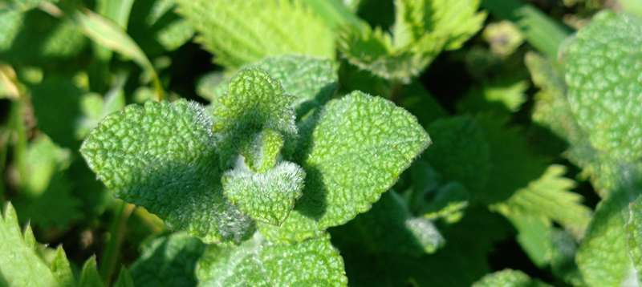

# Mendabellara

Azalpena: Irudiaren arabera hosto iletsu edo azal zimurtsuko belarkara da. Espezie zehatza baieztatzeko identifikazio osagarria gomendatzen da.

## Irudiak

---

**Lokalizazioa:** Kareaga mendia, Aia (Gipuzkoa)
**Katalogo zenbakia:** Landareen_gida-n zerrendaratuta

---
*Dokumentu hau Arantzadi Zientzia Elkartearen baldintzen arabera osatua.*
